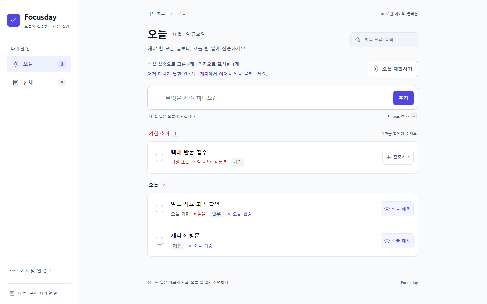
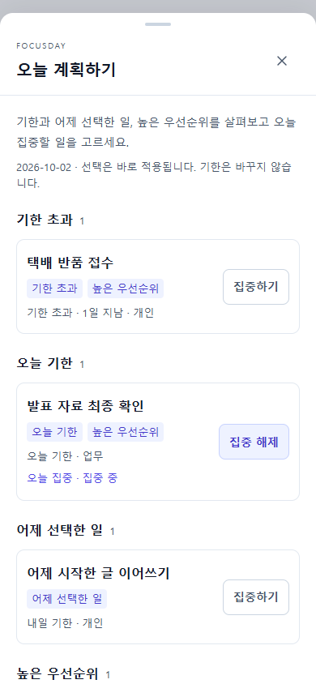
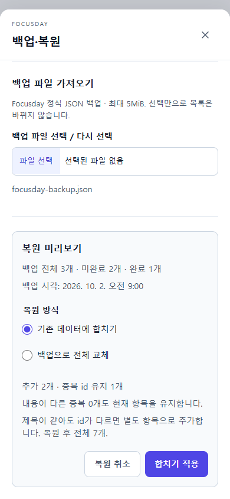

# Focusday

**생각난 일은 빠르게 담고, 오늘 할 일만 선명하게.** 계정 없이 사용하는 개인용 할 일 관리 앱입니다.



**[Focusday 바로 사용하기](https://gsj118.github.io/focusday/)** · [GitHub 저장소](https://github.com/gsj118/focusday). v1.1의 로컬 production 검증을 완료했으며 공개 배포 검증을 진행 중입니다. **로컬 시연:** `pnpm build` → `pnpm preview` → [http://127.0.0.1:4173](http://127.0.0.1:4173).

Node.js 24 / pnpm 11.19.0에서 실행하세요.

```sh
pnpm install --frozen-lockfile
pnpm dev
```

개발 주소는 터미널에 표시됩니다(기본 `http://127.0.0.1:5173`). pnpm이 없다면 `npx pnpm@11.19.0 install --frozen-lockfile`, `npx pnpm@11.19.0 dev`로 시작할 수 있습니다.

## 핵심 차별점

- **오늘 집중 ≠ 기한.** 내일 기한인 일도 오늘 시작할 수 있습니다. 집중을 해제해도 기한이 오늘/과거이면 오늘에 표시하며 이유를 알려줍니다.
- **쌓인 일에서 오늘 계획하기.** 기한 초과·오늘 기한·어제 선택·높은 우선순위 후보를 사실 이유와 함께 보여줍니다. 어제 일은 직접 이어가며 자동 이월하지 않습니다.
- **직접 보관하는 JSON 백업.** 완료·예시·모든 속성을 파일로 보관하고 미리보기 후 합칩니다. 전체 교체는 확인을 거치며 실제 저장 성공 후에만 목록을 바꿉니다.
- **제목 하나로 시작하고 실수는 복구.** 필요한 속성은 상세 편집에서 설정합니다. 완료·삭제는 실행 취소하고 저장 오류와 손상 원본을 명확히 보호합니다.

## v1.1 사용 흐름과 실제 화면

1. 오늘/전체에서 제목을 적고 Enter 또는 **추가**를 누릅니다. 오늘에서 만들면 바로 오늘 집중이 됩니다.
2. 오늘의 **오늘 계획하기**에서 후보를 살펴보고 **집중하기 / 집중 해제**를 선택합니다. 후보 밖의 일은 전체에서 선택할 수 있습니다.
3. **어제 마치지 못한 일 N개**가 있으면 같은 계획 패널에서 이어갈 일을 고릅니다. 기존 id·기한은 유지합니다.
4. 제목을 눌러 기한·우선순위·분류를 편집합니다. **취소/Escape**는 초안을 버립니다. 체크박스로 완료하고 **실행 취소** 또는 완료 영역에서 복원합니다.
5. **예시 및 앱 정보 → 백업·복원**에서 전체 JSON을 다운로드합니다. 파일 선택은 미리보기만 보여줍니다. 기본 **합치기 적용**은 현재의 중복 id를 유지합니다. **전체 교체**는 별도 확인 뒤 적용합니다.

| 모바일 계획 패널                                                                                                | 모바일 복원 미리보기                                                                                           |
| --------------------------------------------------------------------------------------------------------------- | -------------------------------------------------------------------------------------------------------------- |
|  |  |

실제 Chrome production 앱을 촬영했습니다. 모바일은 브라우저 에뮬레이션입니다. [모바일 오늘](docs/screenshots/v1.1/today-mobile.png) · [데스크톱 계획](docs/screenshots/v1.1/plan-desktop.png) · [데스크톱 복원](docs/screenshots/v1.1/restore-desktop.png) · [320px 계획](docs/screenshots/v1.1/plan-320.png).

[3분 시연](docs/demo-script.md) · [v1.0 대비 실제 경로와 선택 이유](docs/V1_1_UPDATE.md) · [CHANGELOG](CHANGELOG.md). 사용자 시간 단축률이나 만족도 향상을 측정했다고 주장하지 않습니다.

## 실행·검증

```sh
pnpm check        # 타입, lint, 단위·서울/뉴욕 날짜 테스트, production build
pnpm preview
```

preview가 실행 중인 상태에서 다른 터미널의 `pnpm test:e2e`로 실제 브라우저 검사를 실행합니다. 없는 경우 자동 시작하지만, 이 Windows 도구 환경에서는 별도 preview를 재사용해 종료까지 확인했습니다. E2E는 격리 context를 사용하고 실제 사용자 브라우저의 데이터를 변경하지 않습니다.

기본은 설치된 Chrome입니다. Chrome이 없으면 `pnpm exec playwright install chromium` 후 `PW_CHANNEL=chromium`을 설정하세요.

```sh
# macOS/Linux
PW_CHANNEL=chromium pnpm test:e2e
```

```powershell
# Windows PowerShell
$env:PW_CHANNEL = 'chromium'
pnpm test:e2e
Remove-Item Env:PW_CHANNEL
```

| 검증                                    | 실제 결과                                                                |
| --------------------------------------- | ------------------------------------------------------------------------ |
| v1.0 baseline                           | 타입·lint·단위 25개·날짜·build·Chrome E2E 25개 PASS, 기준 태그/사본 보존 |
| v1.1 타입·lint·단위·build               | PASS, 단위 42개, 서울·뉴욕 날짜 각각 22개                                |
| 루트 production E2E                     | 55개 PASS: 기존 25개 회귀 + 새 30개                                      |
| Pages `/focusday/` production E2E       | 55개 PASS, fail/skip/flaky 0                                             |
| 1440×900 / 1366×768 / 390×844 / 320×740 | 새 계획·복원·긴 제목·메타데이터·가로 넘침 PASS                           |
| 모바일 touch / 390×480 가시 영역        | 새 패널 조작·복원 PASS (에뮬레이션)                                      |

[실제 검증·오류 처리·미실행 이유](docs/validation.md) · [루트 결과](docs/evidence/v1.1/root-e2e.json) · [Pages 결과](docs/evidence/v1.1/pages-e2e.json). OS 한글 IME는 이벤트 수준이며 실제 휴대폰·Safari/Firefox·스크린 리더·전체 WCAG·사용자 연구·성능 벤치마크는 미실행입니다.

## 데이터와 제한

앱은 **1.1.0**, 저장 형식은 기존 **version:1 / `focusday:v1`**입니다. v1.0 데이터는 마이그레이션·초기화 없이 읽습니다. 초기 읽기 전에 빈 값을 쓰지 않고, 읽기 실패/손상 데이터는 자동 저장과 복원으로 덮어쓰지 않습니다. 쓰기 실패 시 일반 편집은 현재 메모리 변경을 유지하고 재시도를 제공하며, 복원 실패는 적용 전 목록까지 유지합니다.

- JSON 백업은 현재 탭의 전체 목록입니다. 저장 실패 중의 변경도 포함하지만, 보호 중인 손상 저장 원본은 포함하지 않습니다. 원본 다운로드는 별도 복구용이며 정식 백업과 다릅니다.
- 복원은 정식 JSON 파일 **최대 5MiB**입니다. 같은 id는 현재 항목을 유지하고, 다른 id의 같은 제목은 별도 항목입니다. 전체 교체 전에 파일 백업을 보관할 수 있습니다.
- 파일은 사용자가 직접 보관합니다. 서버 백업·기기 간 동기화는 없으며, 사이트 데이터 삭제로 브라우저의 할 일이 사라질 수 있습니다. 서로 다른 사이트 origin은 데이터를 공유하지 않습니다.
- 다중 탭 동시 편집은 보장하지 않습니다. 한 탭 사용이 기본입니다.
- 삭제/완료 실행 취소는 최근 한 건의 알림이 보이는 약 8초 동안 제공하며 hover/포커스 중에는 멈춥니다. 새 행동·새로고침·성공한 복원은 오래된 복구를 정리합니다. 완료는 전체 완료 영역에서 이후에도 복원할 수 있습니다.

## 구조와 구현 범위

React 19.3.0 + TypeScript 5.9.3 + Vite 8.3.2 + 일반 CSS. 설치 버전은 lockfile로 고정합니다. 서버·라우터·전역 상태 라이브러리·UI 프레임워크·외부 웹폰트·API 키 없이 동작합니다.

```text
src/App.tsx              행동·보기·저장 보호·복원의 성공 후 적용
src/domain.ts            입력·날짜·정렬·오늘 계획/어제/요약·복구
src/storage.ts           기존 v1 스키마 validation·읽기/쓰기
src/backup.ts            정식 백업·검증·합치기/교체 준비
src/components/          목록·편집·계획·백업 패널·실행 취소
src/styles.css           시스템 폰트·반응형·포커스·reduced-motion
tests/                   순수 규칙·저장·실제 Chrome 브라우저 검사
```

오늘/전체 두 최상위 메뉴를 유지합니다. 로그인·서버·협업·캘린더·반복·알림·포모도로·메모·하위 작업·테마·PWA·앱 내부 AI는 추가하지 않았습니다. [제품 명세](docs/product-spec.md)에 데이터와 모든 규칙을 기록했습니다.

## 설계 근거와 AI 활용

제공 리서치의 해석, 설계·구현, 저장/날짜/복구 검토, UX·모바일·키보드 검토, 실제 도구 실행·개선을 같은 Codex 세션에서 수행했습니다. 별도 모델·subagent·사람 검토나 사용자 연구를 했다고 주장하지 않습니다.

[리서치](docs/research.md) · [수정 없는 원문](docs/references/deep-research-report.md) · [설계 결정](docs/decisions.md) · [AI 활용](docs/ai-workflow.md) · [v1.1 실행 명세](docs/ai-prompts/04-v1.1-implementation.md) · [현재 요청](docs/ai-prompts/05-v1.1-user-request.md).

## 버전·GitHub·배포

v1.0.0 기준 커밋 `bb8f852`과 [문서·화면·증거](docs/versions/v1.0.0/index.md)를 보존했습니다. v1.1 실제 완료 작업별로 커밋합니다. main push/PR은 CI를 실행하며 Pages는 수동 workflow로 검증한 `/focusday/` 앱을 배포합니다. [배포 결과와 재배포](docs/deployment.md)에 원격 실행과 확인 상태를 기록합니다.

공개 사이트 재검증은 `node scripts/check-deployment.mjs`입니다. 실제 자산·CRUD·계획·어제 이어가기·JSON 백업/합치기를 격리된 데스크톱/모바일 context에서 검사합니다. 새로운 결과/화면은 `docs/evidence/v1.1/`, `docs/screenshots/v1.1/`에 기록해 v1.0 증거를 보존합니다.
