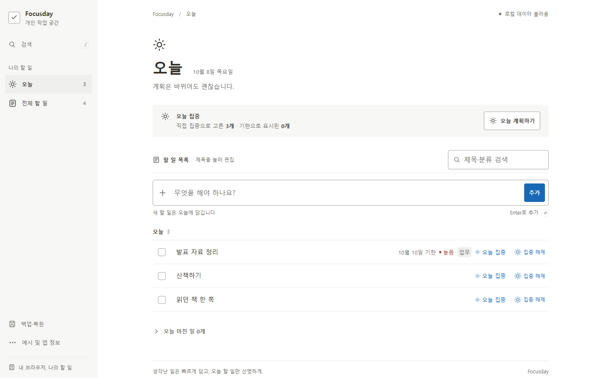
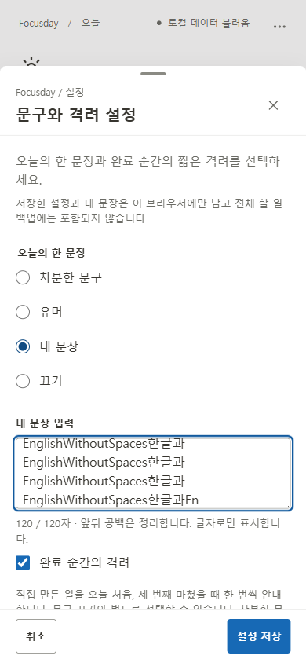
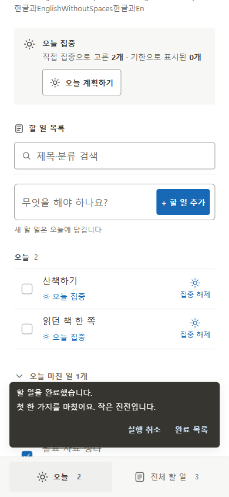

# Focusday

**생각난 일은 빠르게 담고, 오늘 할 일만 선명하게.** 계정 없이 이 브라우저에서 사용하는 개인 작업 앱입니다.

**[Focusday 사용하기](https://gsj118.github.io/focusday/)** · [GitHub](https://github.com/gsj118/focusday). v1.4.0은 노션 작업 UI에 오늘의 한 문장, 완료 순간의 작은 격려, 오늘 마친 일을 더한 최종 제출 버전입니다. [정확한 동작·전후·수정](docs/V1_4_FINAL_UPDATE.md) · [검증](docs/validation.md) · [배포 상태](docs/deployment.md).



## 현재 기능

- **빠른 입력과 오늘 집중.** 제목 Enter로 추가하고 제목을 눌러 속성을 편집합니다. 미래 기한도 오늘 집중으로 고르고 오늘/지난 기한은 집중 해제 뒤에도 오늘에 남습니다. 어제 일은 계획에서 직접 이어갑니다.
- **오늘의 한 문장.** 기본 차분한 문구, 창작 유머, 내 문장, 끄기. 앱 정보의 **문구와 격려 설정**에서 초안을 저장하거나 취소합니다. 같은 로컬 날짜/모드에서는 재방문해도 같은 문구입니다.
- **완료 순간의 격려.** 직접 만든 일을 오늘 처음/세 번째 완료할 때 기존 실행 취소 안내에 한 문장을 더합니다. 각 시점은 하루 한 번 처리하며 격려를 끌 수 있습니다.
- **오늘 마친 일.** 오늘 목록 아래 기본 접힌 영역에서 개수·제목·완료 시각·속성을 확인하고 미완료로 복원합니다. 예시는 제외하고 검색과 무관합니다. 현재 목록 기준이므로 삭제·취소·복원에 따라 바뀝니다.
- **전체 할 일 백업과 복구.** JSON에 완료·예시·모든 속성을 보존합니다. id 합치기/확인 후 교체, 완료·삭제 undo, 손상 원본 보호와 쓰기 실패 재시도를 제공합니다.

| 문구·격려 설정                                                                                                  | 오늘 성취                                                                                                            |
| --------------------------------------------------------------------------------------------------------------- | -------------------------------------------------------------------------------------------------------------------- |
|  |  |

실제 앱의 합성 fixture이며 생성 이미지/목업이 아닙니다. 모바일은 Chrome 에뮬레이션입니다. [320px](docs/screenshots/v1.4/features-second/settings-320x568.png) · [격려/undo](docs/screenshots/v1.4/features-second/encouragement-1440x900.png) · [v1.3와 비교](docs/V1_4_FINAL_UPDATE.md).

## 실행과 검증

Node.js24 / 프로젝트 고정 pnpm11.19.0, React19.3.0 + TypeScript5.9.3 + Vite8.3.2 + 일반 CSS입니다. 기존 lockfile과 의존성을 유지합니다.

```sh
pnpm install --frozen-lockfile
pnpm dev
pnpm check       # 타입/lint/단위/서울·뉴욕 날짜/production build
pnpm test:e2e   # production preview 자동 시작 또는 기존 서버 재사용
```

production은 `pnpm build` → `pnpm preview` → [127.0.0.1:4173](http://127.0.0.1:4173). E2E 기본 브라우저는 설치 Chrome이며 없으면 `pnpm exec playwright install chromium` 후 `PW_CHANNEL=chromium`을 지정합니다. Pages 검증은 `VITE_BASE_PATH=/focusday/` build와 실제 하위 경로 preview를 사용합니다. [환경·명령·원본 결과](docs/validation.md).

이번 작업은 기존80개 baseline을 새로 실행하고12개 관점/26개 연결 단계와 추가 경계를 실제 브라우저에서 검사했습니다. 첫 신규 실행15 PASS/2 FAIL, 첫 전체100 PASS/2 FAIL과 후속 포커스 재현 FAIL을 보존했습니다. 태블릿 sheet 폭·재시도 안내·숨은 성취 행 초점3건을 수정했습니다. 최종 로컬/원격의 정확한 결과는 [검증 기록](docs/validation.md)과 [배포 기록](docs/deployment.md)에 있습니다. 테스트를 삭제/skip하거나 기준을 내려 통과시키지 않았습니다.

## 데이터와 제한

앱1.4.0, 기존 할 일 key `focusday:v1` / AppData version1 / backup formatVersion1을 유지합니다. 전체 할 일 JSON 백업은 compact UTF-8 최대10MiB이며 초과하면 일부를 빼지 않고 다운로드를 중단합니다. 과거 v1 백업을 그대로 읽습니다.

문구/내 문장/격려 여부/날짜별1·3 처리 표지는 별도 `focusday:ui:v1` / UI version1입니다. **설정과 내 문장은 전체 할 일 백업에서 제외**되며 이 브라우저에만 저장합니다. merge/replace는 UI 설정/표지를 유지합니다. 손상 설정은 자동 덮어쓰지 않습니다.

격려 표지 저장 실패에도 완료/undo와 세션 중복 억제는 동작하지만 새로고침 후 중복 방지는 저장 성공에 의존합니다. 일반 task 쓰기 실패는 메모리 변경을 남기고 복원 실패는 적용 전 메모리/원본을 유지합니다. undo는 최근 한 건8초, hover/키보드 포커스 중 멈춥니다.

서버/로그인/동기화·다중 탭 동시 쓰기 해결·기기 간 설정 이동·PWA는 제공하지 않습니다. 로컬 문구는 열린 앱에서 네트워크 없이 표시됩니다. 물리폰/OS 가상 키보드/OS IME/native 확대/스크린 리더/Safari·Firefox/사람 사용자 연구·만족도/과업 시간은 NOT_RUN이며 Chrome 에뮬레이션·합성 composition·동등 reflow와 구분합니다.

## 제출 문서와 개발 기록

[제품 명세](docs/product-spec.md) · [DESIGN](DESIGN.md) · [결정](docs/decisions.md) · [콘텐츠24개](docs/content-v1.4.md) · [12관점/실제 세션](docs/SYNTHETIC_BETA_V1_4.md) · [Case 기대/실제/상태/증거](docs/SYNTHETIC_BETA_CASES_V1_4.md) · [AI 활용](docs/ai-workflow.md) · [3분 시연](docs/demo-script.md) · [명세 원문](docs/ai-prompts/10-v1.4-final-implementation.md).

baseline/설계 → 세 기능 → 첫 평가/수정 → 전체 회귀의 포커스 수정 → 최종 검증/문서 → 원격/공개 확인을 실제 완료 단위로 커밋합니다. [실제 발견 기록](docs/evidence/v1.4/findings.md). CI는 main push/PR, Pages는 **main 수동 workflow**이며 push만으로 배포됐다고 보고하지 않습니다.

| 버전                                                     | 실제 개발 결과와 보존                                                                                 |
| -------------------------------------------------------- | ----------------------------------------------------------------------------------------------------- |
| [v1.0.0](https://github.com/gsj118/focusday/tree/v1.0.0) | 입력·오늘/전체·저장 보호·undo. [보존](docs/versions/v1.0.0/index.md)                                  |
| [v1.1.0](https://github.com/gsj118/focusday/tree/v1.1.0) | 계획·어제 이어가기·backup/restore. [기록](docs/V1_1_UPDATE.md)                                        |
| [v1.2.0](https://github.com/gsj118/focusday/tree/v1.2.0) | Synthetic Beta의 백업/IME 보완. [기록](docs/V1_2_UPDATE.md)                                           |
| [v1.3.0](https://github.com/gsj118/focusday/tree/v1.3.0) | 노션 작업 UI. [기록](docs/V1_3_UI_REDESIGN.md) · [당시 문서](docs/versions/v1.3.0/README.snapshot.md) |
| v1.4.0                                                   | 세 기능과 실제 Beta/수정/최종 제출. [기록](docs/V1_4_FINAL_UPDATE.md)                                 |
