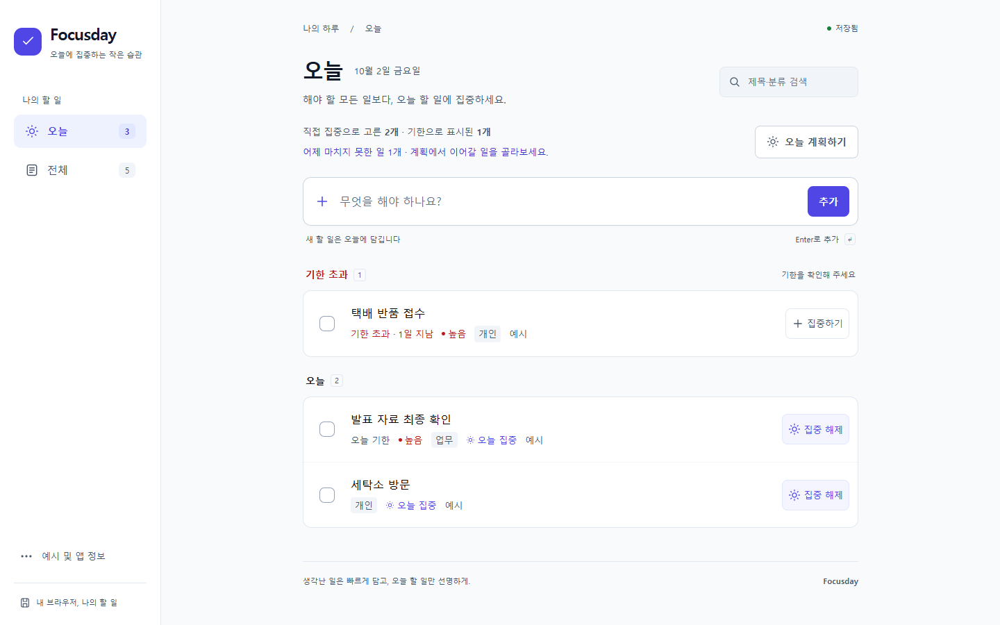
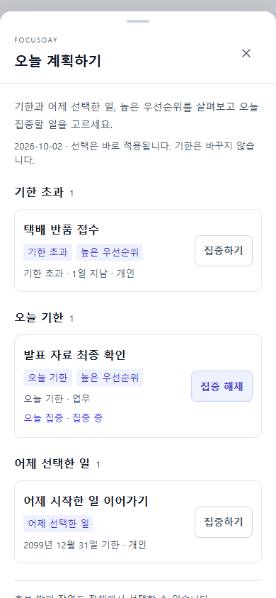

# Focusday

**생각난 일은 빠르게 담고, 오늘 할 일만 선명하게.** 계정 없이 사용하는 개인용 할 일 관리 앱입니다.



**[Focusday 바로 사용하기 · v1.2.0](https://gsj118.github.io/focusday/)** · [GitHub 저장소](https://github.com/gsj118/focusday). 2026-10-02 공개 Chrome 데스크톱·모바일·백업 검증 PASS. [실제 배포 결과](docs/deployment.md). **로컬 시연:** `pnpm build` → `pnpm preview` → [http://127.0.0.1:4173](http://127.0.0.1:4173).

Node.js 24 / pnpm 11.19.0에서 실행하세요.

```sh
pnpm install --frozen-lockfile
pnpm dev
```

개발 주소는 터미널에 표시됩니다(기본 `http://127.0.0.1:5173`). pnpm이 없다면 `npx pnpm@11.19.0 install --frozen-lockfile`, `npx pnpm@11.19.0 dev`로 시작할 수 있습니다.

## 핵심 차별점

- **오늘 집중 ≠ 기한.** 내일 기한인 일도 오늘 시작할 수 있습니다. 집중을 해제해도 오늘/과거 기한이면 오늘에 남으며 이유를 알려줍니다.
- **쌓인 일에서 오늘 계획하기.** 기한 초과·오늘 기한·어제 선택·높은 우선순위 후보를 사실 이유와 함께 보여줍니다. 어제 일은 직접 이어가며 자동 이월하지 않습니다.
- **직접 보관하는 JSON 백업.** 완료·예시·모든 속성을 파일로 보관하고 미리보기 후 합칩니다. 전체 교체는 확인과 실제 저장 성공 뒤 적용합니다. 최대 10MiB이며 초과 내보내기는 중단합니다.
- **제목 하나로 시작하고 실수는 복구.** 필요한 속성은 상세 편집에서 설정합니다. 완료·삭제를 실행 취소하고 저장 오류와 손상 원본을 보호합니다.

## 사용 흐름과 실제 모바일 화면

1. 오늘/전체에서 제목을 적고 Enter 또는 **추가**를 누릅니다. 오늘에서 만들면 바로 오늘 집중이 됩니다.
2. **오늘 계획하기**에서 후보를 확인하고 집중하기/해제를 선택합니다. 어제 미완료가 있으면 같은 패널에서 이어가며 id와 기한을 유지합니다.
3. 제목을 눌러 기한·우선순위·분류를 편집합니다. 상세 제목의 Enter는 줄바꿈, 취소/Escape는 초안을 버립니다. 분류의 조합 확정 Enter가 저장되지 않도록 보호합니다.
4. 체크박스로 완료하고 **실행 취소** 또는 전체의 완료 영역에서 복원합니다.
5. **예시 및 앱 정보 → 백업·복원**에서 전체 JSON을 다운로드합니다. 파일 선택은 미리보기만 보여줍니다. 기본 합치기는 현재의 중복 id를 유지하며 전체 교체는 별도 확인을 거칩니다.

| 모바일 계획                                                                                                         | 모바일 복원 미리보기                                                                                                       |
| ------------------------------------------------------------------------------------------------------------------- | -------------------------------------------------------------------------------------------------------------------------- |
|  |  |

실제 앱을 격리 context의 합성 데이터로 촬영했습니다. 모바일은 Chrome 에뮬레이션이며 AI 이미지/목업이 아닙니다. [320px 계획](docs/screenshots/v1.2/after/plan-320.png) · [3분 시연](docs/demo-script.md).

## v1.2에서 해결한 문제

- **자체 백업 재가져오기:** 6000개 긴 한글 항목의 v1.1 다운로드가 기존 5MiB 한도를 넘는 문제를 재현했습니다. compact JSON·UTF-8 사전 검사·동일 10MiB 한도로 보완했고 기존 padded 파일도 지원합니다.
- **상세 편집 조합 Enter:** 분류의 조합 이벤트 중 Enter가 초안을 저장하던 문제를 수정했습니다. textarea 줄바꿈·일반 저장은 유지합니다. 실제 OS IME 검증은 별도 미실행입니다.

[실제 변경 전후·코드·화면](docs/V1_2_UPDATE.md) · [12개 가상 관점 평가](docs/SYNTHETIC_BETA_V1_2.md) · [53개 항목별 결과](docs/SYNTHETIC_BETA_CASES_V1_2.md).

Synthetic Beta는 AI가 구성한 관점과 실제 조작/자동화 검증을 결합한 평가입니다. 실제 사용자 모집·인터뷰·만족도·사람의 과업 시간은 측정하지 않았습니다. 53개 PASS는 명시한 브라우저 범위이며 물리 기기·OS IME·스크린 리더를 포함하지 않습니다.

## 실행·검증

```sh
pnpm check        # 타입·lint·단위·서울/뉴욕 날짜·production build
pnpm preview
```

preview가 실행 중인 상태에서 다른 터미널의 `pnpm test:e2e`로 실제 브라우저 검사를 실행합니다. 자동 서버도 지원하지만 이 Windows 도구 환경에서는 별도 preview를 재사용해 exit 0까지 확인했습니다. 테스트는 격리 context만 사용하며 실제 사용자 목록을 바꾸지 않습니다.

설치된 Chrome이 기본입니다. Chrome이 없으면 `pnpm exec playwright install chromium` 후 환경 변수를 지정하세요.

```sh
# macOS/Linux
PW_CHANNEL=chromium pnpm test:e2e
```

```powershell
# Windows PowerShell
$env:PW_CHANNEL = 'chromium'
pnpm test:e2e
Remove-Item Env:PW_CHANNEL
```

| 검증                                       | 실제 결과                                                                      |
| ------------------------------------------ | ------------------------------------------------------------------------------ |
| 이번 작업 전 v1.1 baseline                 | 단위 42개·서울/뉴욕 각 22개·build·E2E 55개 PASS                                |
| v1.2 타입·lint·단위·build                  | PASS, 단위 46개·시간대 각각 22개                                               |
| 루트 production / Pages `/focusday/`       | 각각 전체 Chrome E2E 71개 PASS, fail/skip/flaky 0                              |
| 12개 관점 / 53개 명세 Case                 | 실제 세션+기존 UI 근거, 변경 전 51 PASS/2 FAIL → 지원 조건에서 53 PASS         |
| 네 viewport·touch·390×480·200% 동등 reflow | 명시한 에뮬레이션 조건에서 PASS                                                |
| 백업 경계                                  | 6000개 자체 UI 다운로드/미리보기·7000개 순수 round trip·10MiB±1·초과 다운로드0 |
| GitHub CI / Pages 원격 검사                | 모두 성공, 각각 단위46·시간대각22·production build·Chromium E2E71 PASS         |
| 공개 사이트 desktop/mobile / 6000개 백업   | 버전1.2.0·핵심 조작·자산200·오류0·자체 다운로드/재선택 PASS                    |

[실제 결과·환경·미실행 이유](docs/validation.md) · [루트 원본](docs/evidence/v1.2/root-final.json) · [Pages 원본](docs/evidence/v1.2/pages-final.json) · [원격 CI/배포 증거](docs/evidence/v1.2/github-actions.json) · [공개 Chrome 증거](docs/evidence/v1.2/live-deployment.json).

## 데이터와 제한

앱은 **1.2.0**, 저장 형식은 기존 **version:1 / `focusday:v1`**입니다. 초기 읽기는 자동으로 빈 값을 쓰지 않으며 기존 데이터는 마이그레이션 없이 유지합니다.

- 백업은 현재 탭의 전체 메모리 목록입니다. 저장 실패 중의 변경도 포함합니다. 보호된 손상 원본의 다운로드는 별도 복구용이며 정식 백업과 다릅니다.
- 정식 JSON 가져오기와 compact 내보내기 한도는 **10MiB UTF-8 bytes**입니다. 초과하면 전체 내보내기를 중단합니다. 항목을 자르거나 완료·예시를 빼지 않습니다. 모든 크기의 메모리 데이터 보존/round trip을 보장하지 않습니다.
- 파일은 사용자가 직접 보관합니다. 서버 백업·기기 간 동기화가 없고, 사이트 데이터 삭제로 브라우저의 할 일이 사라질 수 있습니다. 다른 origin은 데이터를 공유하지 않습니다.
- 쓰기 실패 시 일반 편집은 메모리 변경을 유지하지만 복원은 적용 전 목록과 원본을 유지합니다. 저장 보호를 파일 복원으로 우회하지 않습니다.
- 완료/삭제 undo는 최근 한 건의 약 8초이며 hover/포커스 중 멈춥니다. 완료는 전체 완료 영역에서도 복원할 수 있습니다. 성공한 복원은 오래된 undo·편집·검색을 정리합니다.
- 다중 탭 동시 편집, 실제 스마트폰/OS IME, Safari/Firefox, native 확대, 스크린 리더·전체 WCAG, 사용자 연구는 이번 검증 범위 밖입니다.

## 구조와 개발 기록

React 19.3.0 + TypeScript 5.9.3 + Vite 8.3.2 + 일반 CSS. 설치 버전은 lockfile로 고정합니다. 서버·라우터·상태/UI 프레임워크·외부 폰트·API 키 없이 동작합니다.

[제품 명세](docs/product-spec.md) · [설계 결정](docs/decisions.md) · [AI 활용 과정](docs/ai-workflow.md) · [v1.2 실행 명세 원문](docs/ai-prompts/06-v1.2-synthetic-beta.md) · [실제 요청](docs/ai-prompts/07-v1.2-user-request.md).

## Development History

| 버전                                                     | 실제 개발 결과·보존 기준                                                                                                    |
| -------------------------------------------------------- | --------------------------------------------------------------------------------------------------------------------------- |
| [v1.0.0](https://github.com/gsj118/focusday/tree/v1.0.0) | 빠른 입력·오늘/전체·기한/집중·저장 보호·undo. [당시 문서·증거](docs/versions/v1.0.0/index.md)                               |
| [v1.1.0](https://github.com/gsj118/focusday/tree/v1.1.0) | 계획·어제 이어가기·백업/복원. [변경 기록](docs/V1_1_UPDATE.md) · [이번 기준 보존](docs/versions/v1.1.0/index.md)            |
| [v1.2.0](https://github.com/gsj118/focusday/tree/v1.2.0) | Synthetic Beta로 자체 백업/편집 조합 Enter 보완. [53개 검사](docs/SYNTHETIC_BETA_CASES_V1_2.md) · [CHANGELOG](CHANGELOG.md) |

기존 태그·이력을 유지하고 실제 작업별 커밋을 남깁니다. CI는 main push/PR, Pages는 **main의 수동 workflow**입니다. `node scripts/check-deployment.mjs`는 공개 버전·자산·데스크톱/모바일·입력/계획/백업과 6000개 자체 미리보기를 검사하며 새 증거/화면을 `docs/evidence/v1.2/`, `docs/screenshots/v1.2/`에 저장합니다. [배포와 재검증](docs/deployment.md).
