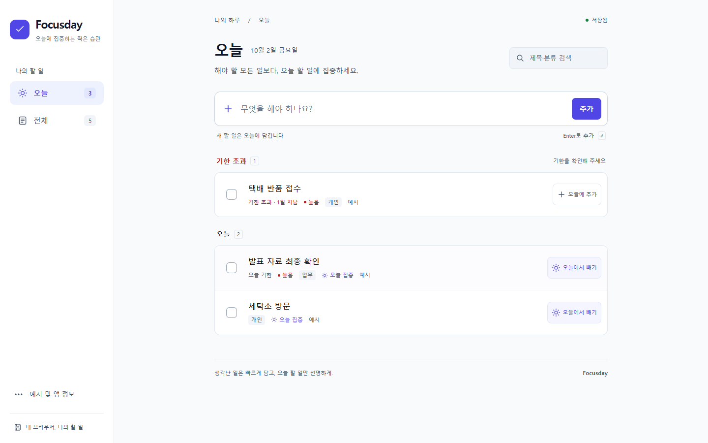
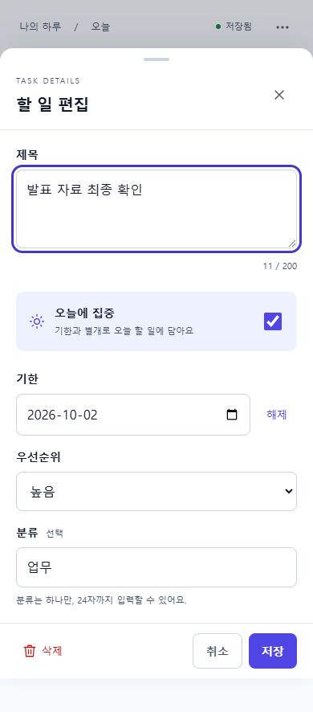

# Focusday

**생각난 일은 빠르게 담고, 오늘 할 일만 선명하게.** 계정 없이 사용하는 개인용 할 일 관리 앱입니다.



**공개 시연:** 아직 게시되지 않았습니다. GitHub 인증은 정상이며 대상 과제 저장소를 지정해야 합니다. **로컬 시연:** `pnpm build` → `pnpm preview` → [http://127.0.0.1:4173](http://127.0.0.1:4173). 실제 Chrome에서 이 production 앱을 검증했습니다.

Node.js 24와 pnpm 11.19.0에서 프로젝트 폴더를 열고 실행하세요.

```sh
pnpm install --frozen-lockfile
pnpm dev
```

개발 주소는 터미널에 표시됩니다(기본 `http://127.0.0.1:5173`). pnpm이 없다면 `npx pnpm@11.19.0 install --frozen-lockfile`, `npx pnpm@11.19.0 dev`로 시작할 수 있습니다.

## 핵심 차별점

- **오늘 집중 ≠ 기한.** 내일이 기한인 일도 오늘 미리 시작할 수 있습니다. 하루가 바뀌면 어제 집중한 일은 전체에 남고, 지난 기한은 오늘의 기한 초과에 표시됩니다.
- **제목 하나로 시작.** 오늘/전체에서 바로 입력하고, 필요한 기한·우선순위·분류만 상세 편집에서 설정합니다.
- **저장과 복구를 분명하게.** 실제 저장 성공 후에만 ‘저장됨’을 표시합니다. 완료·삭제는 실행 취소할 수 있고 손상된 데이터는 조용히 덮어쓰지 않습니다.

## 화면과 사용 흐름

| 모바일 오늘 화면                                                                       | 모바일 상세 편집                                                                                           |
| -------------------------------------------------------------------------------------- | ---------------------------------------------------------------------------------------------------------- |
|  |  |

모두 실제 production 앱에서 촬영했습니다. 모바일 이미지는 브라우저 에뮬레이션입니다. [데스크톱 편집](docs/screenshots/desktop-editor.png), [1366px 화면](docs/screenshots/layout-1366.png), [320px 화면](docs/screenshots/layout-320.png)도 확인할 수 있습니다.

1. 오늘에서 제목을 적고 Enter 또는 **추가**를 누릅니다. 전체에서 작성하면 오늘에는 자동으로 담기지 않습니다.
2. 전체에서 **오늘에 추가**로 집중할 일을 고릅니다. 기한은 그대로 유지됩니다.
3. 제목을 눌러 편집하고 **저장**으로 적용합니다. **취소/Escape**는 초안을 버립니다.
4. 체크박스로 완료합니다. **실행 취소**하거나 전체의 **완료된 할 일**에서 복원합니다.
5. 예시는 빈 화면의 **예시로 둘러보기**로 선택하거나 작은 **예시 및 앱 정보** 메뉴에서 관리합니다.

[2~3분 시연 절차](docs/demo-script.md)를 따라 제품의 핵심 흐름을 보여줄 수 있습니다.

## 구현 범위

빠른 입력, 오늘/전체 보기, 오늘 추가·제거, 기한 설정·해제, 제목·속성 편집, 네 단계 우선순위, 단일 분류, 완료·복원, 삭제·실행 취소, 제목·분류 검색, 선택형 예시, 빈 상태·저장 오류, 반응형 UI와 키보드 흐름을 구현했습니다.

로그인·서버·동기화·협업·캘린더·반복·알림·메모·하위 작업·테마·PWA·앱 내부 AI는 범위에 포함하지 않았습니다. [최종 제품 명세](docs/product-spec.md)에 전체 규칙을 기록했습니다.

## 실행·검증

```sh
pnpm check        # TypeScript, ESLint, 단위·시간대 테스트, production build
pnpm preview     # 빌드 결과 확인
```

preview가 실행 중인 상태에서 **다른 터미널**의 `pnpm test:e2e`로 실제 브라우저 테스트를 수행합니다. 이 Windows 실행 환경에서는 별도로 시작한 preview 서버를 사용해 테스트 종료까지 확인했습니다.

Chrome이 없는 환경은 `pnpm exec playwright install chromium` 후 실행할 수 있습니다.

```sh
# macOS/Linux
PW_CHANNEL=chromium pnpm test:e2e
```

```powershell
# Windows PowerShell
$env:PW_CHANNEL = 'chromium'
pnpm test:e2e
Remove-Item Env:PW_CHANNEL
```

E2E는 먼저 production build가 있어야 합니다. 실행 중인 preview를 재사용하며 없는 경우 자동으로 시작합니다. 테스트는 격리된 브라우저 context를 사용하고 사용자의 실제 브라우저 데이터는 변경하지 않습니다. `test-results/`는 Git에서 제외합니다. `pnpm format`으로 소스를 정리할 수 있습니다.

| 검증                                     | 결과                                             |
| ---------------------------------------- | ------------------------------------------------ |
| TypeScript·ESLint·production build       | PASS                                             |
| 도메인·저장 단위 테스트                  | 25개 PASS (서울·뉴욕 날짜 테스트도 별도 통과)    |
| 실제 Chrome E2E                          | 25개 PASS ([검증 기록](docs/validation.md))      |
| 1440×900 / 1366×768 / 390×844 / 320×740  | 목록·편집기·긴 제목·가로 넘침 PASS               |
| 한글 IME                                 | composition 이벤트 검증 PASS, 실제 OS IME 미실행 |
| 실제 스마트폰·Safari·Firefox·사용자 연구 | NOT_RUN                                          |

검증 환경, 기대/실제 결과, 수정한 결함, 증거와 미실행 이유는 [validation.md](docs/validation.md)에 있습니다. WCAG 전체 준수나 실측하지 않은 성능을 주장하지 않습니다.

## 데이터와 제한

할 일은 이 사이트의 브라우저 `localStorage` 한 키(`focusday:v1`)에 저장됩니다. 초기 로드 전에 빈 데이터를 쓰지 않습니다. 접근·읽기 실패 때도 원본 보호를 위해 자동 저장을 멈춥니다. 다시 읽기가 성공하면 기존 항목과 현재 탭 항목을 합칩니다. 쓰기 실패 때 현재 메모리 변경은 유지하고 지속 경고와 재시도를 제공합니다.

손상된 JSON·스키마·지원하지 않는 버전은 원본 다운로드를 제공합니다. 초기화는 별도 확인 UI에서 명시적으로 선택해야 하며 원본 대신 현재 탭의 목록을 저장합니다.

- 사이트 데이터 삭제·브라우저 정책에 의해 할 일이 사라질 수 있습니다. 서버 백업과 다른 기기 동기화는 없습니다.
- 다중 탭 동시 편집은 보장하지 않습니다. 한 탭에서 사용하는 것을 기본으로 합니다.
- 삭제 복구는 가장 최근 완료/삭제 한 건의 **실행 취소**가 보이는 약 8초 동안만 가능합니다. hover나 키보드 포커스 중에는 남은 시간이 멈춥니다. 새 완료/삭제가 이전 복구를 대체하며 새로고침하면 복구 정보는 사라집니다.
- 완료 항목은 실행 취소가 만료되어도 전체의 완료 영역에서 미완료로 복원할 수 있습니다.
- 실제 사용자 인터뷰·과업 테스트는 실시하지 않았습니다. 주 사용자와 제품 가치는 리서치에 근거한 설계 가설입니다.

## 구조와 기술

React 19.3.0 + TypeScript 5.9.3 + Vite 8.3.2 + 일반 CSS. 서버, 라우터, 전역 상태 라이브러리, UI 프레임워크, 외부 웹폰트·API 키 없이 동작합니다. 실제 설치 버전은 `pnpm-lock.yaml`로 고정합니다.

```text
src/
  App.tsx                 보기·사용자 행동·저장 상태 연결
  domain.ts               날짜·보기·정렬·입력·예시·복구 규칙
  storage.ts              로드·스키마 검증·쓰기 경계
  useToday.ts             로컬 자정·focus·visibility 갱신
  useVisualViewport.ts    모바일 가시 영역과 편집기 높이
  components/             할 일 행·편집기·실행 취소 알림
  styles.css              시스템 폰트·반응형·포커스·reduced-motion
tests/                    규칙 단위 테스트·실제 브라우저 E2E
```

## 설계 근거와 AI 활용

AI는 제공 리서치의 해석 → 설계 선택 → 코드 작성 → 저장/날짜/복구 검토 → UX/모바일 검토 → 접근성/문서 검토 → 실제 도구 실행과 결함 수정에 사용했습니다. 같은 Codex 세션의 자체 검토이며 별도 모델·사람 검토를 받았다고 주장하지 않습니다.

[리서치 요약](docs/research.md) · [수정 없는 원문](docs/references/deep-research-report.md) · [설계 결정](docs/decisions.md) · [AI 활용 과정](docs/ai-workflow.md) · [최초 제작 지시](docs/ai-prompts/01-implementation.md) · [검토와 수정 기록](docs/ai-prompts/02-review-notes.md)

## GitHub 제출·배포

로컬 Git에 실제 완료 작업별 커밋을 남겼습니다. 대상 remote가 없어 push·공개 배포는 실행하지 않았습니다. 새 공개 저장소를 임의로 만들지 않았습니다.

CI와 수동 GitHub Pages workflow를 포함합니다. 기본 자산 경로는 상대 경로이며 Pages workflow는 실제 저장소의 `base_path`를 사용합니다. [배포 준비와 필요한 정보](docs/deployment.md)를 참고하세요. 배포 후 실제 페이지·자산 로딩이 확인되면 위 공개 시연에 검증된 URL을 추가할 수 있습니다.
