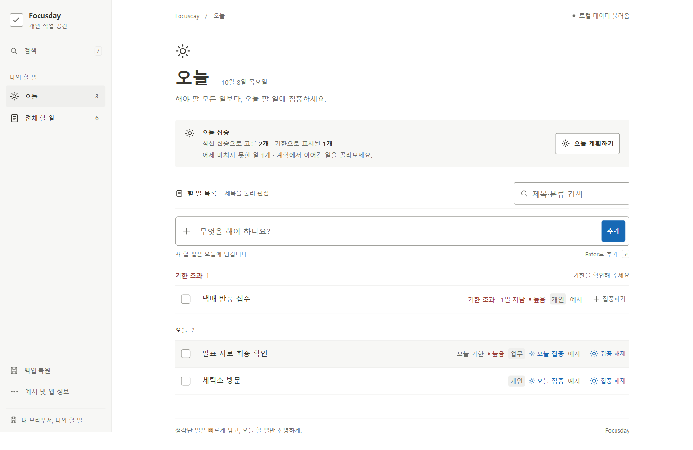
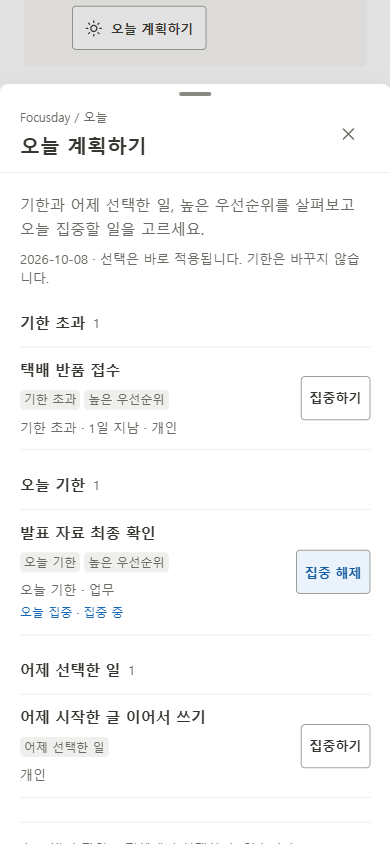
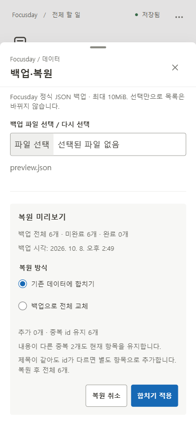

# Focusday

**생각난 일은 빠르게 담고, 오늘 할 일만 선명하게.** 계정 없이 사용하는 개인용 할 일 관리 앱입니다.



**[Focusday 바로 사용하기](https://gsj118.github.io/focusday/)** · [GitHub 저장소](https://github.com/gsj118/focusday). v1.3.0은 노션 작업 화면을 참고해 사이드바·목록·계획·편집·백업·모바일을 교체한 버전입니다. 원격/공개 확인 상태는 [배포 기록](docs/deployment.md)에 구분합니다.

Node.js 24 / pnpm 11.19.0에서 실행하세요.

```sh
pnpm install --frozen-lockfile
pnpm dev
```

개발 주소는 터미널에 표시됩니다(기본 `http://127.0.0.1:5173`). pnpm이 없다면 `npx pnpm@11.19.0 install --frozen-lockfile`로 설치합니다. production 시연: `pnpm build` → `pnpm preview` → [http://127.0.0.1:4173](http://127.0.0.1:4173).

## 핵심 경험

- **오늘 집중 ≠ 기한.** 미래 기한의 일도 오늘 시작합니다. 집중을 해제해도 오늘/과거 기한이면 오늘에 남으며 이유를 알려줍니다.
- **쌓인 일에서 오늘 계획하기.** 기한 초과·오늘 기한·어제 선택·높은 우선순위 후보를 사실 이유와 함께 보여줍니다. 어제 일은 직접 이어가며 id·기한을 유지합니다.
- **빠른 입력과 조용한 작업 목록.** 제목 하나로 추가하고 제목을 눌러 속성을 편집합니다. 작은 화면에서도 기한·우선순위·분류·예시·집중 상태를 확인합니다.
- **직접 보관하는 JSON 백업.** 전체 속성·완료·예시를 포함하고 미리보기 후 합칩니다. 전체 교체는 확인과 저장 성공 뒤 적용합니다. compact 내보내기/가져오기 한도는 동일한 10MiB입니다.
- **실수와 저장 오류 복구.** 완료·삭제 실행 취소, 손상 원본 보호, 실패한 복원 이전 상태 유지와 재시도를 제공합니다.

## 사용 흐름과 실제 모바일 화면

1. 오늘/전체 할 일에서 제목을 적고 Enter 또는 **추가**를 누릅니다. 오늘에서 만들면 오늘 집중이며 성공하면 같은 입력창에 포커스가 남습니다.
2. **오늘 계획하기**에서 후보의 집중하기/해제를 선택합니다. 어제 미완료도 같은 패널에서 직접 이어갑니다.
3. 제목을 눌러 기한·우선순위·분류를 편집합니다. **저장**만 적용하며 취소/Escape는 초안을 버립니다. 제목의 Enter는 줄바꿈입니다.
4. 체크박스로 완료하고 **실행 취소** 또는 전체의 완료 영역에서 복원합니다.
5. 사이드바 **백업·복원**, 모바일 **예시 및 앱 정보 → 백업·복원**에서 JSON을 다운로드합니다. 파일 선택은 미리보기이며 합치기는 중복 id의 현재 항목을 유지합니다.

| 모바일 계획                                                                                                      | 모바일 복원 미리보기                                                                                                    |
| ---------------------------------------------------------------------------------------------------------------- | ----------------------------------------------------------------------------------------------------------------------- |
|  |  |

격리 Chrome context의 실제 앱 화면입니다. 모바일은 에뮬레이션이며 생성 이미지/목업이 아닙니다. [320px 편집](docs/screenshots/v1.3/after/editor-320x568.png) · [3분 시연](docs/demo-script.md).

## v1.3 UI 교체

232px 회색 사이드바, 흰 작업 페이지, 36/30px 제목, 얇은 구분선, 약56px 기본 행과 작은 직사각형 태그로 구성했습니다. 선택/호버는 중립 표면, 집중/실행은 대비를 확보한 파란색입니다. 큰 화면의 속성은 제목 옆에, 좁은 화면에서는 아래에 배치합니다. 모바일 집중 조작에도 텍스트를 표시합니다.

계획·편집·백업은 우측 패널/모바일 sheet를 공유합니다. 편집은 제목과 라벨/값 속성 행, 별도 저장·취소·삭제 영역을 사용합니다. 빈 상태·검색 없음·undo·오류·저장 보호도 같은 CSS 토큰을 따릅니다.

[설계와 참조](DESIGN.md) · [변경 전후·검수·수정](docs/V1_3_UI_REDESIGN.md) · [Before](docs/screenshots/v1.3/before/today-1440x900.png) · [After](docs/screenshots/v1.3/after/today-1440x900.png).

## 실행·검증

```sh
pnpm check        # 타입·lint·단위·서울/뉴욕 날짜·production build
pnpm preview
```

다른 터미널에서 `pnpm test:e2e`를 실행합니다. preview 재사용과 자동 서버 모두 지원합니다. 기본은 설치된 Chrome이며 없으면 `pnpm exec playwright install chromium` 후 `PW_CHANNEL=chromium`을 지정합니다. 검증은 격리 context만 사용합니다.

| v1.3 실제 실행               | 결과                                                                            |
| ---------------------------- | ------------------------------------------------------------------------------- |
| 작업 전 v1.2 baseline        | 타입·lint·단위46·서울/뉴욕 각22·build·E2E71 PASS                                |
| 변경 후 `pnpm check`         | 타입·lint·단위46·서울/뉴욕 각22·build PASS                                      |
| 루트 production Chrome E2E   | 80 PASS, fail/skip/flaky0                                                       |
| Pages `/focusday/` build·E2E | 80 PASS, fail/skip/flaky0, 자산200. [원본](docs/evidence/v1.3/pages-final.json) |
| 실제 화면                    | 명세6개 viewport +390×480 +720×450 동등 reflow, 별도18개 상태 촬영              |
| 기능 회귀                    | 기존71개 유지, 검색/백업/초점/긴 정보/조작 영역/대비9개 추가                    |
| GitHub CI·Pages·공개 사이트  | [실제 원격/공개 결과](docs/deployment.md)                                       |

[환경·명령·결과·미실행](docs/validation.md) · [루트 원본](docs/evidence/v1.3/root-final.json). 실제 스마트폰·가상 키보드·OS 한글 IME·native200% zoom·스크린 리더·Safari/Firefox·사람 사용자 연구는 미실행입니다. 축소 viewport·합성 이벤트·Chrome reflow와 구분합니다.

## 데이터와 제한

앱은 **1.3.0**, 저장 형식은 기존 **version:1 / `focusday:v1`**입니다. 기존 데이터를 마이그레이션 없이 읽습니다. domain/storage/backup/date hook과 lockfile은 이번 작업에서 변경하지 않았습니다.

- 백업은 현재 탭의 전체 메모리 목록이며 저장 실패 중의 변경도 포함합니다. 보호된 손상 원본 다운로드는 별도 복구용입니다.
- 정식 백업은 최대 **10MiB UTF-8 bytes**입니다. 초과하면 전체 내보내기를 중단하며 항목을 자르거나 완료·예시를 제외하지 않습니다.
- 파일은 직접 보관합니다. 서버 백업·기기 간 동기화가 없고 사이트 데이터 삭제로 할 일이 사라질 수 있습니다. 서로 다른 origin은 데이터를 공유하지 않습니다.
- 일반 쓰기 실패는 메모리 변경을 유지하고 복원 실패는 적용 전 목록과 원본을 유지합니다. 저장 보호를 파일 복원으로 우회하지 않습니다.
- undo는 최근 한 건의 약8초이며 hover/포커스 중 멈춥니다. 성공한 복원은 오래된 undo·편집·검색을 정리합니다.
- 다중 탭 동시 편집, 대량 목록 성능/storage quota, 전체 WCAG·보안 감사는 검증 범위 밖입니다.

## 구조와 개발 기록

React19.3.0 + TypeScript5.9.3 + Vite8.3.2 + 일반 CSS. 서버·라우터·상태/UI 프레임워크·외부 폰트·API 없이 동작합니다.

[제품 명세](docs/product-spec.md) · [설계 결정](docs/decisions.md) · [AI 활용 과정](docs/ai-workflow.md) · [v1.3 구현 명세 원문](docs/ai-prompts/08-v1.3-implementation.md) · [실제 요청](docs/ai-prompts/09-v1.3-user-request.md).

## Development History

| 버전                                                     | 실제 개발 결과·보존                                                                                                               |
| -------------------------------------------------------- | --------------------------------------------------------------------------------------------------------------------------------- |
| [v1.0.0](https://github.com/gsj118/focusday/tree/v1.0.0) | 빠른 입력·오늘/전체·기한/집중·저장 보호·undo. [보존](docs/versions/v1.0.0/index.md)                                               |
| [v1.1.0](https://github.com/gsj118/focusday/tree/v1.1.0) | 계획·어제 이어가기·백업/복원. [변경](docs/V1_1_UPDATE.md), [보존](docs/versions/v1.1.0/index.md)                                  |
| [v1.2.0](https://github.com/gsj118/focusday/tree/v1.2.0) | Synthetic Beta로 백업 크기/조합 Enter 보완. [53개 검사](docs/SYNTHETIC_BETA_CASES_V1_2.md), [보존](docs/versions/v1.2.0/index.md) |
| v1.3.0                                                   | 노션 작업 UI 전체 교체와 기존 데이터/기능 보존. [전후·검수](docs/V1_3_UI_REDESIGN.md), [CHANGELOG](CHANGELOG.md)                  |

기존 태그·이력을 유지하고 실제 변경 단위로 커밋합니다. CI는 main push/PR, Pages는 **main 수동 workflow**입니다. 공개 확인 도구는 새 증거/화면을 `docs/evidence/v1.3/`, `docs/screenshots/v1.3/`에 저장합니다. [배포와 재검증](docs/deployment.md).
